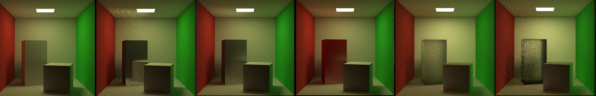

# Optix Path Tracer
A simple optix patch tracer that implements diffuse, specular, transmittance effect.
## Complie:
put folder in optix7.0 SDK folder, update camkelist.txt file.
## Sample output:

